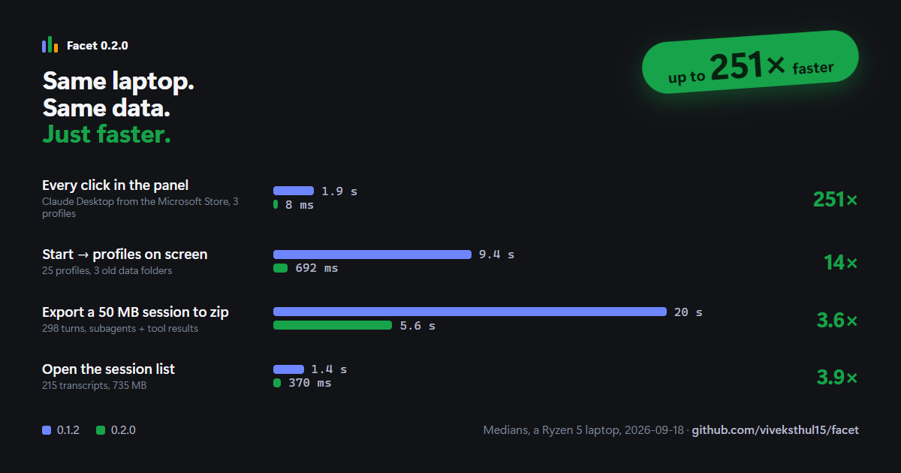

# Facet

**One identity. Many facets.** A tiny Windows tray launcher that opens Claude Desktop on the right session, every time.

Run multiple Claude Desktop accounts side-by-side — work, personal, client — each in its own isolated data directory. Sign in once per profile; sessions stay put.

Inspired by [synthetixis/lanes](https://github.com/synthetixis/lanes) (macOS); rebuilt from scratch for Windows in Electron.

---

## Download

**[⬇ Facet-Setup.exe](https://github.com/viveksthul15/facet/releases/latest/download/Facet-Setup.exe)** — installer (recommended)

**[⬇ Facet-Portable.exe](https://github.com/viveksthul15/facet/releases/latest/download/Facet-Portable.exe)** — portable, no install

> **First launch — SmartScreen warning:** Windows shows *"Windows protected your PC"* because Facet is not code-signed (that would cost me $100/year for a certificate). Click **More info → Run anyway**. The source is right here — read it, build it yourself, or trust that others have.

---

## The whole trick

```
Claude.exe --user-data-dir="%LOCALAPPDATA%\Facet\profiles\claude-work"
```

Claude Desktop is Electron. Point it at a per-profile data directory and each launch gets an independent session. That's the entire mechanism.

## It never touches your tokens

- **No token handling.** Facet only *chooses a directory* and *spawns a process*. It never reads, copies, moves, or writes your session material.
- **No network, ever.** Zero analytics, zero phone-home, zero update checks.
- **Tray only.** No taskbar entry, no main window, no background services beyond the notification-area icon.

<!-- speed:start — generated by marketing/build-docs.mjs, do not edit by hand -->
## Speed

0.2.0 removed the work Facet used to repeat on every click. Medians of 5 runs on a Ryzen 5 laptop (AMD Ryzen 5 7530U laptop, 14.8 GB RAM, NVMe SSD, Microsoft Windows 11), packaged build, same machine and data for both versions. Method, raw numbers and caveats: [BENCHMARKS.md](BENCHMARKS.md).

| | 0.1.2 | 0.2.0 | |
|---|---:|---:|---|
| Every panel action — Claude from the Microsoft Store | 1.9 s | 8 ms | **251× faster** |
| Every panel action — 25 profiles, 3 old data folders | 8.6 s | 6 ms | **1489× faster** |
| Start → profiles on screen, 25 profiles | 9.4 s | 692 ms | **14× faster** |
| Open the session list, 215 transcripts | 1.4 s | 370 ms | **3.9× faster** |
| Filter the session list, per keystroke | 79 ms | 8 ms | **10× faster** |
| Export a 50 MB session | 20 s | 5.6 s | **3.6× faster** |
| Export a 1 MB session | 2.9 s | 514 ms | **5.6× faster** |


<!-- speed:end -->

## Run from source

Requires Node.js 18+.

```
npm install
npm start
```

Click the tri-color facet mark in the notification area (bottom-right of the taskbar). Windows 11 hides new tray icons by default — click the ⌃ overflow arrow and drag Facet out to pin it.

## Build

```
npm run build
```

Produces both an NSIS installer and a portable exe under `dist/`. Requires Windows Developer Mode ON so electron-builder can extract its signing helper archive.

## Export a Claude session

Claude Code's `/export` — the one that wrote a zip of the whole session — is gone from the
desktop app. The CLI still has a `/export`, but it is declared `requires: { ink: true }`: it
exists only inside the terminal renderer, it only ever handles the *current* conversation, and
it writes a flat `conversation-<timestamp>.txt`, not the archive. There is no headless form of
it, so nothing can call it from the desktop app.

Facet rebuilds the archive instead. **Tray → Export a session…** (or **Manage → Export a
session**) lists every session transcript under `~/.claude/projects` — desktop and CLI share
that folder — and writes the one you pick to a zip:

```
<cliSessionId>.jsonl              raw transcript
transcript.jsonl                  byte-identical duplicate, as the real export wrote it
<cliSessionId>/subagents/…        subagent transcripts, meta, journal
<cliSessionId>/tool-results/…     oversized tool results
<cliSessionId>/workflows/…        workflow run records + the scripts as executed
logs/*.log                        Claude app logs, if you asked for them
metadata.json                     reconstructed from the transcript — it says so in the file
local-session-state.json
extras/readable/…                 a Markdown transcript you can actually read
README-EXPORT.md                  contents table and anything left out
```

Two options sit under the list. **Include app logs** picks which Facet profile's logs to bundle —
logs live in the Claude data directory, and under Facet each profile has its own, so Facet cannot
know which one a session came from. **Keep large task payloads** stops it dropping tool dumps over
20 MB; those are usually a dataset, not conversation, and either way `README-EXPORT.md` lists what
was left out by name and size.

`metadata.json` is rebuilt from the transcript, not captured. Six fields — `remoteMcpServersConfig`,
`prs`, `bridgeSessionIds`, `chromePermissionMode`, `sessionSettings`, `spawnSeed` — cannot be
recovered and are written empty rather than guessed. Its `_reconstructed` field says as much.

The work is done by `tools/session-export.mjs`, which reads local files and calls
`Compress-Archive` — no network, no API key, no quota. It runs on Electron's own Node, so Facet
does not need Node installed. You can also run it by hand:

```
node tools/session-export.mjs --list --all
node tools/session-export.mjs <sessionId-prefix> --out my-export.zip
```

## Keyboard

- **Ctrl + Alt + C** (default global hotkey) — open the panel from anywhere; re-bindable in Settings
- **Alt + 1** … **Alt + 9** — launch the profile at that slot
- **Enter** on a profile — launch it
- **F2** on a profile — inline rename
- **Right-click** a profile — Launch · Open data folder · Rename · Duplicate · Remove
- **Esc** — hide the panel (or back out of Add/Manage/Settings)

## Where things live

| Thing | Path |
|---|---|
| Profile index | `%LOCALAPPDATA%\Facet\facet.json` |
| Settings | `%LOCALAPPDATA%\Facet\settings.json` |
| Profile data dirs | `%LOCALAPPDATA%\Facet\profiles\claude-<slug>\` |
| Debug logs | `%LOCALAPPDATA%\Facet\logs\YYYY-MM-DD.log` |
| Adopted profile (in place) | `%APPDATA%\Claude\` |
| Enterprise policy override | `%PROGRAMDATA%\Facet\policy.json` |

Profile data lives under `%LOCALAPPDATA%` on purpose — Chromium session state is large and shouldn't roam across machines.

## Portable mode

Drop an empty `portable.txt` next to `Facet.exe` and Facet stores everything in `FacetData/` beside itself — nothing in `%APPDATA%` or `%LOCALAPPDATA%`. Runs off a USB drive, corp-locked machine, whatever.

The portable installer above does this automatically.

## Enterprise deployment

Drop `%PROGRAMDATA%\Facet\policy.json` with any of:

```json
{
  "customClaudePath": "C:\\corp\\ClaudeManaged.exe",
  "launchAtLogin": true,
  "globalHotkey": "Control+Alt+C",
  "confirmOnQuit": true
}
```

Keys present in policy are locked in the Settings UI. Users see a lock icon and can't change them.

## Honest about what this is

Unofficial personal-productivity utility. Not affiliated with, endorsed by, or supported by Anthropic. It launches the official Claude Desktop app you already have installed; it does not modify or repackage it.

Running multiple accounts may be subject to your plan's terms — check them, especially on Team or Enterprise plans.

## License

MIT.
